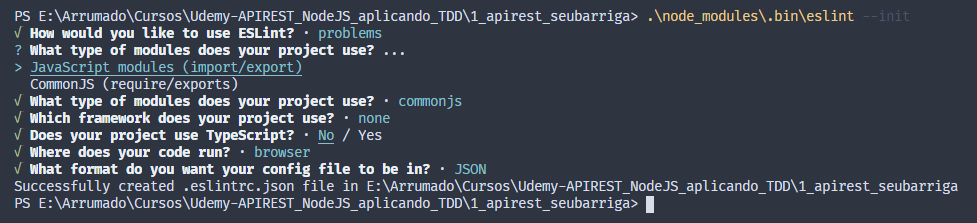

# Curso da plataforma Udemy: API REST em Node.JS aplicando testes (TDD) desde o princípio

*Descrição do curso:* Utilize o TDD para desenvolver um gerenciador financeiro com a segurança dos testes automatizados sempre a seu lado.

## Sobre o sistema a ser desenvolvido

Há os Usuários. Os usuários possuem contas.

Através da conta é possível realizar transações. Ex: Receber dinheiro por depósito.

Também é possível fazer transferência de uma conta A para uma conta B.
Isso gera duas transações:

- 1°: Dinheiro saindo da conta A.
- 2°: Dinheiro sendo recebido na conta B.

Com isso, calculamos o saldo de alguma conta considerando apenas as transações, já que a transferência gera transações.

### Principais códigos http status utilizados

- 200: OK (requisição foi bem sucedida)
- 201: Created (requisição foi bem sucedida e foi criado um novo recurso como resultado)
- 403: Forbidden (usuário não tem acesso)
- 404: Not Found (rota não encontrada)
- 500: Internal Server Error (servidor encontrou um erro que não consegue lidar)

Link para mais status: [Códigos de status de respostas HTTP](https://developer.mozilla.org/pt-BR/docs/Web/HTTP/Status)

## Anotações sobre o Visual Studio

### Mexendo pelo terminal

- `code .`  – abre o vs code na pasta que está no terminal
- `touch teste.js` – cria um arquivo chamado teste.js
- `rm teste.js` – remove um arquivo chamado teste.js

### Mudando as configurações de cores

CTRL + Shift + P e escrever “theme” e selecionar preferencias de cores
Tem como baixar temas também na aba de extensões

### Instalar a fonte fira code com chocolatey

`choco install firacode`

### Extensões do VS Code

- **Bracket Pair Colorizer** – Diferencia os níveis de cores dos colchetes. Torna mais fácil a navegação.
- **Gitlens** – Suporte para o git.
- **TODO Tree** – Serve para realizar marcações em comentários para serem resolvidas depois e o plugin mostra elas em forma de lista. Facilitando a busca.

## Anotações sobre o Node JS

### Executando o arquivo node pelo terminal

``node teste.js``
Criando um projeto: npm init –y

### Habilitando o eslint no projeto

``npm i -D eslint`` – indica que está instalando a dependência eslint em ambiente de desenvolvimento só.
Após isso, executar no terminal ``.\node_modules\.bin\eslint –init``

Configurações escolhidas:



Realizando a verificação de formatação dos arquivos que estão nas pastas src e test:

``.\node_modules\.bin\eslint src/** test/** --fix``

Para executar ``npm run lint``, tem que adicionar o parâmetro lint no arquivo package.json (caso não exista arquivos na pasta, haverá erro ao executar o comando)

### Configurando o Jest no projeto

**Instalando:** ``npm i –D jest@23.6.0 –E`` – dependência que será instalada apenas em ambiente de dev e em uma versão específica. –E garante que vai pegar a versão e não vai atualizar depois.

*Curiosidade sobre versionamentos:* [httpshttps://semver.org/lang/pt-BR/](httpshttps://semver.org/lang/pt-BR/)

**Para rodar o jest:** ``.\node_modules\.bin\jest``

OBS: caso não haja testes escritos, informará que nenhum teste foi encontrado.

Para executar apenas ``npm test``, atualizar o scripts test no package.json para “jest” apenas.
Como estamos usando o lint, tem que informar ao lint que estamos usando o jest para ele não ficar reclamando. Para isso, basta alterar o arquivo .eslintrc.json e adicionar o jest como true no env.

Como vamos testar api, vamos instalar uma dependência que vai facilitar as coisas com requisições http.

***Para instalar o supertest:*** ``npm i –D –E supertest@3.3.0``
Após instalar, basta “importar” no arquivo que vai ser utilizado.

### Criando um servidor NodeJS

**Instalar a dependência do express:** ``npm i –S –E express@4.16.4`` – não instala como dependência de dev apenas pois é do projeto em si (então –S ao invés de -D)

### Rodando a aplicação no modo seguro

**Para executar os testes em tempo real:** ``npm run secure-mode``

Permite que ao realizar as alterações na aplicação, já tenha um feedback muito rápido para ver se a aplicação ainda está consistente após a alteração do dev. E lembrar de incluir no package.json.

### Mexendo com migrations

**Instalar a dependência:** ``npm i –S –E knex``

- *Criando uma migration pelo terminal:*
``node_modules/.bin/knex migrate:make create_users --env test``
- *Aplicando todas as migrações possíveis:*
``node_modules/.bin/knex migrate:latest --env test``
- *Voltando a aplicação da migrations:*
``node_modules/.bin/knex migrate:rollback --env test``

### Dependencias para criptografia de senha e autenticacao

``npm i -S -E bcrypt-nodejs``

``npm i -S -E jwt-simple@0.5.5``

``npm i -S -E passport@0.4.0``

``npm i -S -E passport-jwt@4.0.0``

### Entendendo sobre os seeds

São arquivos para inserir dados de exemplo ou para teste automaticamente na base de dados.

Para incluir o seed no projeto, adicionar esse trecho no arquivo knexfile.js: ``seeds:{ directory: 'src/seeds' },``

**Criando um seed para uma base de dados:**
``node_modules/.bin/knex seed:make transfer --env test``

**Executando o seed para povoar a tabela:**
``node_modules/.bin/knex seed:run --env test``

OBS: O seed executa na ordem dos arquivos e para não termos problemas com isso utilizaremos uma numeração nos arquivos como:

- 01_transfer.js
- 02_balance.js

### Caso nada do jest tenha sido configurado no package.json

- *Para executar o teste e mostrar o resuminho da execução:* ``node_modules/.bin/jest --verbose=true --watchAll`` (chamado como secure-mode no projeto também)
- *Para executar os testes e mostrar a cobertura:* ``node_modules/.bin/jest --coverage``

As vezes executar os testes diretamente sem ser pelo modo seguro pode dar problemas, pois estamos precisando de inserções/consultas no banco de dados. Para garantir que os testes vão executar de forma sequencial, rodamos o seguinte comando: ``node_modules/.bin/jest --coverage --runInBand``
OBS: Eu estava tendo bastante problemas quando eu estava executando sem o parâmetro ``--runInBand``.

E executando o Jest diretamente pode ser que eu não consiga sair da execução automaticamente, para resolver isso temos: ``node_modules/.bin/jest --coverage --runInBand --forceExit``

## Sobre cobertura dos testes

Indica apenas as linhas que foram ou não exercitadas pelo teste. Ter testes com 100% de cobertura não indica, necessariamente, que seu sistema está funcionando sem bugs.

Com o Jest é possível estabelecer um threshold de cobertura para os testes a nível de statements, branches, functions e lines. Basta adicionar esse trecho de código no package.json:

```{json}
..."main": "index.js",
  "jest":{
    "coverageThreshold": {
      "global": {
        "statements": 80,
        "branches": 80,
        "functions": 80,
        "lines": 80
      }
    }
  },
  "scripts": {...} ...
```

Como a configuração acima é global, podemos configurar uma cobertura específica também da seguinte forma:

```{json}
    "./src/services": {
        "lines": 100
      }
```

### Para aumentar a confiança nos commits

Antes de fazer commits no git, podemos verificar se as boas práticas do lint estão sendo cumpridas e se os testes estão passando.

Para fazer os commits apenas se os testes estão passando e se as alterações, precisamos instalar a dependência: `npm i -S -E husky@1.2.0`.

E depois, basta adicionar isso no package.json:

```{json}
"scripts": { ... },
  "husky":{
    "hooks": { "pre-commit": "npm run lint &&npm test" }
  },
```

Então com tudo isso configurado, toda vez que fizer um commit os testes e o lint será executado.

## Sobre o ambiente de produção

- Adicionamos o ambiente de produção no knexfile.js.
- Criamos a tabela de produção.
- Executamos as migrações no ambiente de prod: ``node_modules/.bin/knex migrate:latest --env prod``

Colocando para a aplicação executar o ambiente de prod quando for iniciada ou no ambiente de teste quando forem ser realizados os testes. Basta editar o package.json:

```{json}
  "scripts": {
    "start": "NODE_ENV=prod &&node src/server.js",
    "test": "NODE_ENV=test && jest --coverage --runInBand --forceExit",
    "lint": "eslint src/** test/** --fix",
    "secure-mode": "NODE_ENV=test &&jest --watchAll --verbose=true"
  },
```

Caso seja necessário configurar o ambiente como um todo no computador, tem como executar o seguinte comando para definir variáveis de ambiente:
``export QUALQUER=funciona`` (linux e mac)

### Logs

Para poder implementar a parte de logs, tem que instalar as seguintes dependências: 

``npm i -S -E uuidv4@2.0.0 winston@3.1.0``

### Para manter o servidor no ar

Para deixar o servidor no ar, tem que instalar a seguinte dependência: 

``npm i pm2 -g``

Com isso, deve ir até a pasta do projeto e executar: ``pm2 start npm -- start``. OBS: Não deu para executar esse comando porque estava dando um erro informando que caminho_aplicacao/start não foi encontrado.

Dessa forma, você pode fechar o terminal e sua aplicação não irá sair do ar.

Para observar os processos: ``pm2 status``

Para parar o processo: ``pm2 stop 0``
